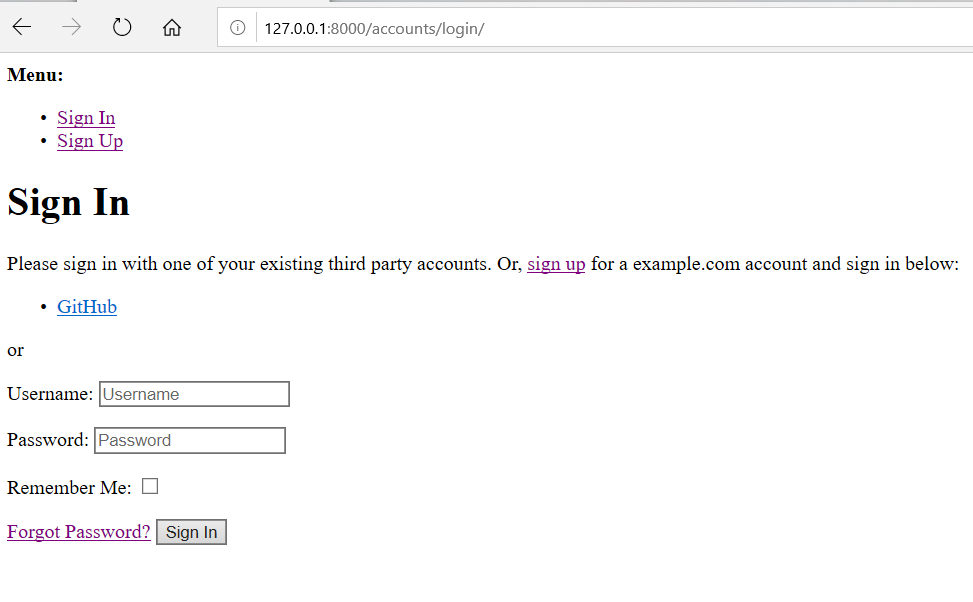
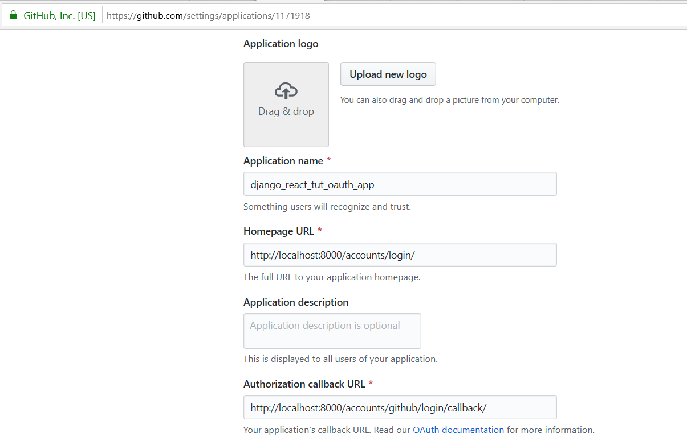
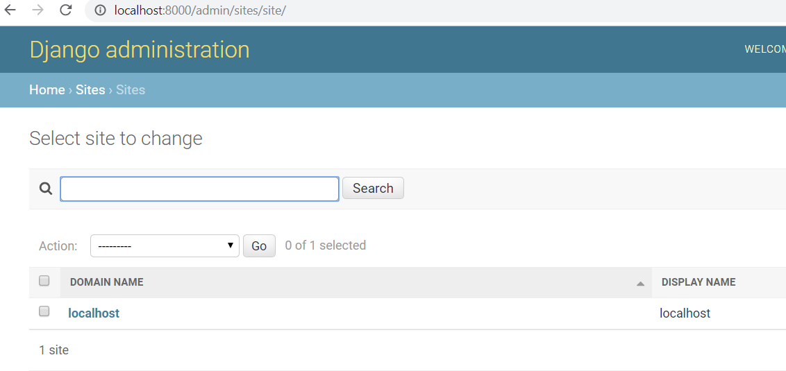
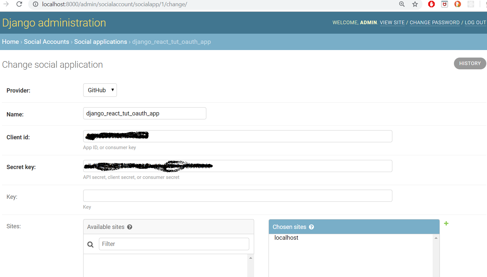
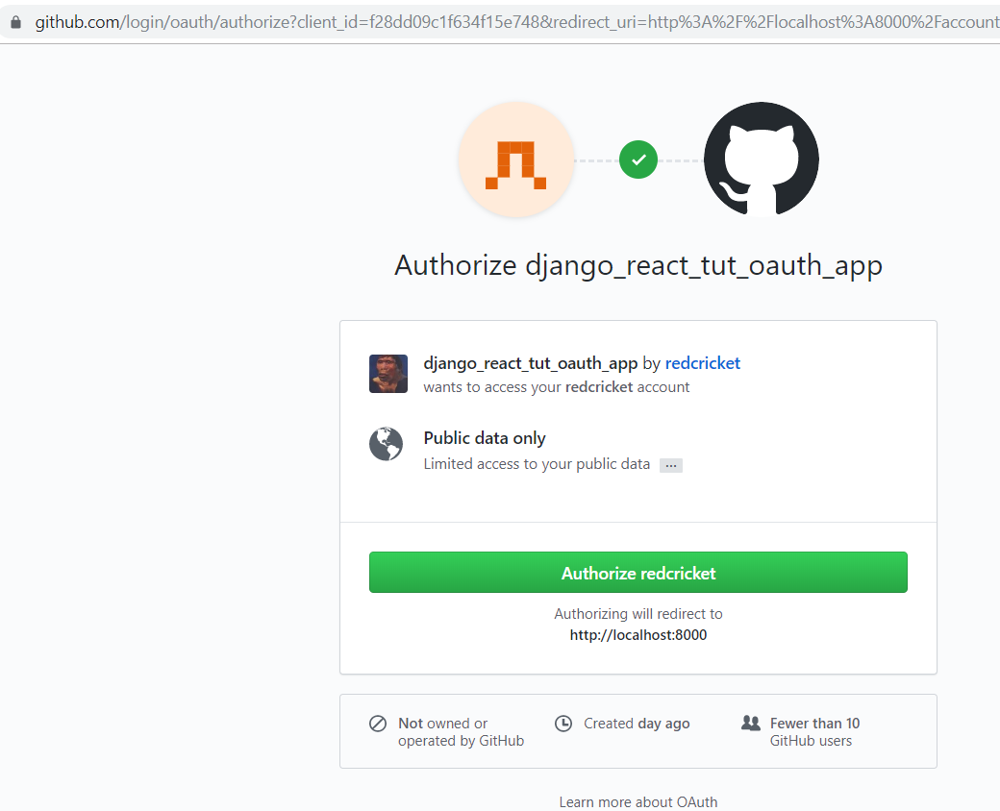
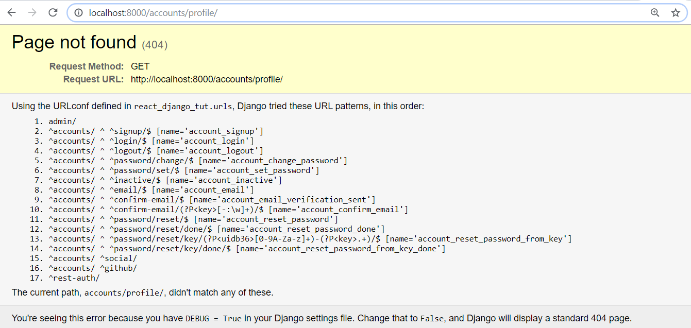

# React Django Tutorial

# Start Here

I developing on a Windows 10 system.  I will be using PyCharm.

## Install Django

First we need to set up Django.  That is well documented here: https://www.djangoproject.com/.
Here's what I did. Opened a terminal from PyCharm and executed:


```bash
(venv) C:\Users\plankton\PycharmProjects\react_django_tut>pip install Django
```

Then I opened a Python Console in PyCharm and executed:

```python
import django
print(django.get_version())
2.2.7
```

## Create a Django Project

At this point it is a good idea to create a Django project.  This is because we are going to install Django Rest
Framework (DRF), django-allauth and django-rest-auth and these packaages require some changes to our Django project's
settings.py file.

So in the PyCharm terminal execute:

```bash
(venv) C:\Users\plankton\PycharmProjects\react_django_tut>django-admin startproject react_django_tut
```

You can QA at this point by executing:

```python
(venv) C:\Users\plankton\PycharmProjects\react_django_tut>cd react_django_tut
(venv) C:\Users\plankton\PycharmProjects\react_django_tut\react_django_tut>python manage.py runserver
Watching for file changes with StatReloader
Performing system checks...

System check identified no issues (0 silenced).

You have 17 unapplied migration(s). Your project may not work properly until you apply the migrations for app(s): admin, auth, contenttypes, sessions.
Run 'python manage.py migrate' to apply them.
November 14, 2019 - 19:54:13
Django version 2.2.7, using settings 'react_django_tut.settings'
Starting development server at http://127.0.0.1:8000/
Quit the server with CTRL-BREAK.
```

Point your browser to http://127.0.0.1:8000 and you should see the default Django project splash screen.

## Install Django Rest Framework (DRF)

This is documented here: https://www.django-rest-framework.org/#installation

That installation docs say to do this ...

```bash
pip install djangorestframework
pip install markdown       
pip install django-filter  
```

So I executed the above pip install commands. The install docs also say to make this change to your settings.py file.
Change ...

```python
INSTALLED_APPS = [
    'django.contrib.admin',
    'django.contrib.auth',
    'django.contrib.contenttypes',
    'django.contrib.sessions',
    'django.contrib.messages',
    'django.contrib.staticfiles',
]
```

... to this ....

```python
INSTALLED_APPS = [
    'django.contrib.admin',
    'django.contrib.auth',
    'django.contrib.contenttypes',
    'django.contrib.sessions',
    'django.contrib.messages',
    'django.contrib.staticfiles',
    'rest_framework',
]
```


## Install Django AllAuth

Documentation is here: https://django-allauth.readthedocs.io/en/latest/

In my terminal I execute:

```python
pip install django-allauth
```

The install docs say we need to make these changes in our project's settings.py file.

Change ...

```python
TEMPLATES = [
    {
        'BACKEND': 'django.template.backends.django.DjangoTemplates',
        'DIRS': [],
        'APP_DIRS': True,
        'OPTIONS': {
            'context_processors': [
                'django.template.context_processors.debug',
                'django.template.context_processors.request',
                'django.contrib.auth.context_processors.auth',
                'django.contrib.messages.context_processors.messages',
            ],
        },
    },
]
```

... to this ...

```
TEMPLATES = [
    {
        'BACKEND': 'django.template.backends.django.DjangoTemplates',
        'DIRS': [],
        'APP_DIRS': True,
        'OPTIONS': {
            'context_processors': [
                'django.template.context_processors.debug',
                'django.template.context_processors.request',
                'django.contrib.auth.context_processors.auth',
                'django.contrib.messages.context_processors.messages',
                # `allauth` needs this from django
                'django.template.context_processors.request',
            ],
        },
    },
]
```

And then add these lines:

```python
AUTHENTICATION_BACKENDS = (
    # Needed to login by username in Django admin, regardless of `allauth`
    'django.contrib.auth.backends.ModelBackend',
    # `allauth` specific authentication methods, such as login by e-mail
    'allauth.account.auth_backends.AuthenticationBackend',
)
```

And then change ...

```
INSTALLED_APPS = [
    'django.contrib.admin',
    'django.contrib.auth',
    'django.contrib.contenttypes',
    'django.contrib.sessions',
    'django.contrib.messages',
    'django.contrib.staticfiles',
    'rest_framework',
]
```

... to ...


```
INSTALLED_APPS = [
    'django.contrib.admin',
    'django.contrib.auth',
    'django.contrib.contenttypes',
    'django.contrib.sessions',
    'django.contrib.messages',
    'django.contrib.staticfiles',
    'rest_framework',
    # The following apps are required:
    'django.contrib.sites',
    'allauth',
    'allauth.account',
    'allauth.socialaccount',
    # ... include the providers you want to enable:
    'allauth.socialaccount.providers.github',
]
```

Also add this line:

```python
SITE_ID = 1
```

We also need to update our project's url.py file

Change ...

```python
from django.urls import path
```

... to ...

```python
from django.urls import path, include
from django.conf.urls import url
```

and then change ..

```python
urlpatterns = [
    path('admin/', admin.site.urls),
    url(r'^accounts/', include('allauth.urls')),
]
```

django-allauth installation requires we execute `migrate`

So in the terminal execute:

```
(venv) C:\Users\plankton\PycharmProjects\react_django_tut\react_django_tut>python manage.py migrate
```

You should QA at this point by starting the django server like so:

```
(venv) C:\Users\plankton\PycharmProjects\react_django_tut\react_django_tut>python manage.py runserver
```

And then point your browser to 127.0.0.1:8000/accounts/login/

You should see this:



## Install Django Rest Auth

Documentation for installing django-rest-auth here: https://django-rest-auth.readthedocs.io/en/latest/installation.html

So in the terminal execute:

```bash
pip install django-rest-auth
```

We also need to change the `INSTALLED_APPS` in the `settings.py` file.

So change ...

```python
INSTALLED_APPS = [
    'django.contrib.admin',
    'django.contrib.auth',
    'django.contrib.contenttypes',
    'django.contrib.sessions',
    'django.contrib.messages',
    'django.contrib.staticfiles',
    'rest_framework',
    # The following apps are required:
    'django.contrib.sites',
    'allauth',
    'allauth.account',
    'allauth.socialaccount',
    # ... include the providers you want to enable:
    'allauth.socialaccount.providers.github',
]
```

... to ...

```python
INSTALLED_APPS = [
    'django.contrib.admin',
    'django.contrib.auth',
    'django.contrib.contenttypes',
    'django.contrib.sessions',
    'django.contrib.messages',
    'django.contrib.staticfiles',
    'rest_framework',
    # added as per django-rest-auth docs.
    # https://django-rest-auth.readthedocs.io/en/latest/installation.html
    'rest_framework.authtoken',
    # The following apps are required:
    'django.contrib.sites',
    'allauth',
    'allauth.account',
    'allauth.socialaccount',
    # ... include the providers you want to enable:
    'allauth.socialaccount.providers.github',
    # added as per django-rest-auth docs.
    # https://django-rest-auth.readthedocs.io/en/latest/installation.html
    'rest_auth'
]
```

The django-rest-auth documentation also says we need to update the project's urls.py file.

So in the urls.py file change ...

```python
urlpatterns = [
    path('admin/', admin.site.urls),
    url(r'^accounts/', include('allauth.urls')),
]
```

... to ...

```python
urlpatterns = [
    path('admin/', admin.site.urls),
    url(r'^accounts/', include('allauth.urls')),
    # added as per django-rest-auth docs.
    # https://django-rest-auth.readthedocs.io/en/latest/installation.html
    url(r'^rest-auth/', include('rest_auth.urls'))
]
```

Then the documenation says we need to execute in the terminal this command:

```bash
python manage.py migrate
```

## Enabling Github social authentication 

The documentation for this is here: 

https://django-rest-auth.readthedocs.io/en/latest/installation.html#social-authentication-optional
https://django-rest-auth.readthedocs.io/en/latest/installation.html#github

The documentation is not very clear.  It states:

> Add Social Application in django admin panel

So we need to be able to use the django admin panel.
Before we can do that we need to create a super user.
So in the terminal execute:

```bash
(venv) C:\Users\plankton\PycharmProjects\react_django_tut\react_django_tut>python manage.py createsuperuser
```

Then do ...

also see:

https://developer.github.com/v3/guides/basics-of-authentication/
https://developer.github.com/v3/guides/basics-of-authentication/#registering-your-app

On github we do this: 

https://github.com/settings/developers
click on 'Register a new application' button

(see screen shots)



Once we register our app with git hub we get this web page: https://github.com/settings/applications/1171918

Now in the admin panel nagivate to Admin > Sites panel to change `example.com` to `localhost`.



Also in the Home › Social Accounts › Social applications:

Now back in our app's admin panel we fill out: http://localhost:8000/admin/socialaccount/socialapp/add/
create a social application called `django_react_tut_oauth_app`.  



Now we can QA our github access by going to:

http://localhost:8000/accounts/login/

and click the 'GitHub' link.

You should see this:



Click the 'Authorize redcrick' button and you end up here:




TODO: figure out how to fix the 404 error.

