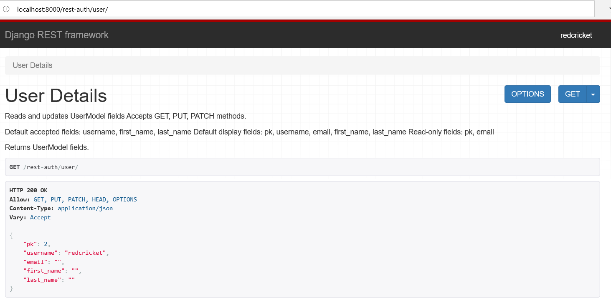
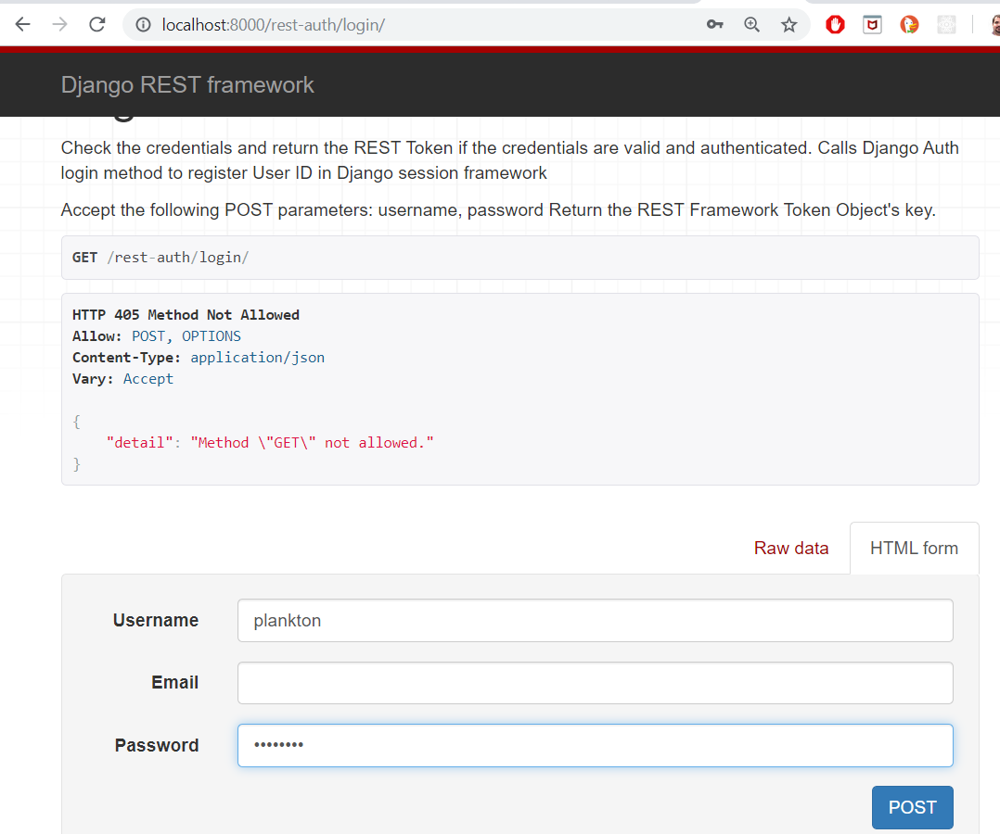

# React Django Tutorial

This tutorial assumes you are familiar with Python, Django and Django Rest Framework.
If not, there's are plenty of documentation online.

 * https://www.djangoproject.com/start/
 * https://www.django-rest-framework.org/
 
 The tutorials are great.
 
# Start Here

I am developing on a Windows 10 system.  I will be using PyCharm.

## Install Django

First we need to set up Django.  That is well documented here: https://www.djangoproject.com/.
Here's what I did. Opened a terminal from PyCharm and executed:


```
(venv) C:\Users\plankton\PycharmProjects\react_django_tut>pip install Django
```

Then I opened a Python Console in PyCharm and executed:

```
import django
print(django.get_version())
2.2.7
```

## Create a Django Project

At this point it is a good idea to create a Django project.  This is because we are going to install Django Rest
Framework (DRF), django-allauth and django-rest-auth and these packages require some changes to our Django project's
settings.py file.

So in the PyCharm terminal execute:

```
(venv) C:\Users\plankton\PycharmProjects\react_django_tut>django-admin startproject react_django_tut
```

The above creates a Django project called `react_django_tut`.

### QA Django Project Creation 

You can QA at this point by executing:
```
(venv) C:\Users\plankton\PycharmProjects\react_django_tut>cd react_django_tut
(venv) C:\Users\plankton\PycharmProjects\react_django_tut\react_django_tut>python manage.py runserver
Watching for file changes with StatReloader
Performing system checks...

System check identified no issues (0 silenced).

You have 17 unapplied migration(s). Your project may not work properly until you apply the migrations for app(s): admin, auth, contenttypes, sessions.
Run 'python manage.py migrate' to apply them.
November 14, 2019 - 19:54:13
Django version 2.2.7, using settings 'react_django_tut.settings'
Starting development server at http://127.0.0.1:8000/
Quit the server with CTRL-BREAK.
```

Point your browser to http://127.0.0.1:8000 and you should see the default Django project splash screen.

## Install Django Rest Framework (DRF)

This is documented here: https://www.django-rest-framework.org/#installation

That installation docs say to do this ...

```bash
pip install djangorestframework
pip install markdown       
pip install django-filter  
```

So I executed the above pip install commands. The install docs also say to make this change to your settings.py file.
Change ...

```python
INSTALLED_APPS = [
    'django.contrib.admin',
    'django.contrib.auth',
    'django.contrib.contenttypes',
    'django.contrib.sessions',
    'django.contrib.messages',
    'django.contrib.staticfiles',
]
```

... to this ....

```python
INSTALLED_APPS = [
    'django.contrib.admin',
    'django.contrib.auth',
    'django.contrib.contenttypes',
    'django.contrib.sessions',
    'django.contrib.messages',
    'django.contrib.staticfiles',
    'rest_framework',
]
```

The line ...

```
    'rest_framework',
```

... was added.

## Install Django AllAuth

Documentation is here: https://django-allauth.readthedocs.io/en/latest/

In my terminal I execute:

```
pip install django-allauth
```

The install docs say we need to make these changes in our project's settings.py file.

Change ...

```python
TEMPLATES = [
    {
        'BACKEND': 'django.template.backends.django.DjangoTemplates',
        'DIRS': [],
        'APP_DIRS': True,
        'OPTIONS': {
            'context_processors': [
                'django.template.context_processors.debug',
                'django.template.context_processors.request',
                'django.contrib.auth.context_processors.auth',
                'django.contrib.messages.context_processors.messages',
            ],
        },
    },
]
```

... to this ...

```python
TEMPLATES = [
    {
        'BACKEND': 'django.template.backends.django.DjangoTemplates',
        'DIRS': [],
        'APP_DIRS': True,
        'OPTIONS': {
            'context_processors': [
                'django.template.context_processors.debug',
                'django.template.context_processors.request',
                'django.contrib.auth.context_processors.auth',
                'django.contrib.messages.context_processors.messages',
                # `allauth` needs this from django
                'django.template.context_processors.request',
            ],
        },
    },
]
```

The lines ...

```
                # `allauth` needs this from django
                'django.template.context_processors.request',
```

... were added.

And then add these lines:

```python
AUTHENTICATION_BACKENDS = (
    # Needed to login by username in Django admin, regardless of `allauth`
    'django.contrib.auth.backends.ModelBackend',
    # `allauth` specific authentication methods, such as login by e-mail
    'allauth.account.auth_backends.AuthenticationBackend',
)
```

And then change ...

```
INSTALLED_APPS = [
    'django.contrib.admin',
    'django.contrib.auth',
    'django.contrib.contenttypes',
    'django.contrib.sessions',
    'django.contrib.messages',
    'django.contrib.staticfiles',
    'rest_framework',
]
```

... to ...


```
INSTALLED_APPS = [
    'django.contrib.admin',
    'django.contrib.auth',
    'django.contrib.contenttypes',
    'django.contrib.sessions',
    'django.contrib.messages',
    'django.contrib.staticfiles',
    'rest_framework',
    # The following apps are required:
    'django.contrib.sites',
    'allauth',
    'allauth.account',
    'allauth.socialaccount',
    # ... include the providers you want to enable:
    'allauth.socialaccount.providers.github',
]
```

The lines ...

```
    # The following apps are required:
    'django.contrib.sites',
    'allauth',
    'allauth.account',
    'allauth.socialaccount',
    # ... include the providers you want to enable:
    'allauth.socialaccount.providers.github',
```

... were added.

Also add this line:

```python
SITE_ID = 1
```

We also need to update our project's url.py file

Change ...

```
from django.urls import path
```

... to ...

```
from django.urls import path, include
from django.conf.urls import url
```

and then ensure `urlpatterns` list gets initialized like so: 

```
urlpatterns = [
    path('admin/', admin.site.urls),
    url(r'^accounts/', include('allauth.urls')),
]
```

django-allauth installation requires we execute `migrate`

So in the terminal execute:

```
(venv) C:\Users\plankton\PycharmProjects\react_django_tut\react_django_tut>python manage.py migrate
```

### QA Djano AllAuth 

You should QA at this point by starting the django server like so:

```
(venv) C:\Users\plankton\PycharmProjects\react_django_tut\react_django_tut>python manage.py runserver
```

And then point your browser to 127.0.0.1:8000/accounts/login/

You should see this:


## Install Django Rest Auth

Documentation for installing django-rest-auth here: https://django-rest-auth.readthedocs.io/en/latest/installation.html

So in the terminal execute:

```bash
pip install django-rest-auth
```

We also need to change the `INSTALLED_APPS` in the `settings.py` file.

So change ...

```python
INSTALLED_APPS = [
    'django.contrib.admin',
    'django.contrib.auth',
    'django.contrib.contenttypes',
    'django.contrib.sessions',
    'django.contrib.messages',
    'django.contrib.staticfiles',
    'rest_framework',
    # The following apps are required:
    'django.contrib.sites',
    'allauth',
    'allauth.account',
    'allauth.socialaccount',
    # ... include the providers you want to enable:
    'allauth.socialaccount.providers.github',
]
```

... to ...

```python
INSTALLED_APPS = [
    'django.contrib.admin',
    'django.contrib.auth',
    'django.contrib.contenttypes',
    'django.contrib.sessions',
    'django.contrib.messages',
    'django.contrib.staticfiles',
    'rest_framework',
    # added as per django-rest-auth docs.
    # https://django-rest-auth.readthedocs.io/en/latest/installation.html
    'rest_framework.authtoken',
    # The following apps are required:
    'django.contrib.sites',
    'allauth',
    'allauth.account',
    'allauth.socialaccount',
    # ... include the providers you want to enable:
    'allauth.socialaccount.providers.github',
    # added as per django-rest-auth docs.
    # https://django-rest-auth.readthedocs.io/en/latest/installation.html
    'rest_auth'
]
```

The lines ...

```
    # added as per django-rest-auth docs.
    # https://django-rest-auth.readthedocs.io/en/latest/installation.html
    'rest_framework.authtoken',
```

... lines ...

```
    # added as per django-rest-auth docs.
    # https://django-rest-auth.readthedocs.io/en/latest/installation.html
    'rest_auth'
```

... were added.

The django-rest-auth documentation also says we need to update the project's urls.py file.

So in the urls.py file change ...

```
urlpatterns = [
    path('admin/', admin.site.urls),
    url(r'^accounts/', include('allauth.urls')),
]
```

... to ...

```
urlpatterns = [
    path('admin/', admin.site.urls),
    url(r'^accounts/', include('allauth.urls')),
    # added as per django-rest-auth docs.
    # https://django-rest-auth.readthedocs.io/en/latest/installation.html
    url(r'^rest-auth/', include('rest_auth.urls'))
]
```

The line ...

```
    url(r'^rest-auth/', include('rest_auth.urls'))
```

... was added.

Then the documentation says we need to execute in the terminal this command:

```
python manage.py migrate
```

## Enabling Github Social Authentication 

In this tutorial we are only concerned with GitHub social authentication.
At this point you should log on to your GitHub account.

### Register a new OAuth application with GitHub`

The documentation for doing this can be found here:
https://developer.github.com/v3/guides/basics-of-authentication/#registering-your-app

**VERY IMPORTANT SECURITY ISSUE**
> Every registered OAuth application is assigned a unique Client ID and Client Secret. 
> The Client Secret should not be shared! That includes checking the string into your repository.

On github we do this: 

https://github.com/settings/developers
click on **'Register a new application'** button


 

Once we register our app with git hub we get this web page: https://github.com/settings/applications/1171918
**In that web you can see your Client ID and Client Secret.**  You will need these values when we add a Social
Application record with the Django admin panel.

### Add Social Application in Django Admin Panel

The documentation for this is here: 

https://django-rest-auth.readthedocs.io/en/latest/installation.html#social-authentication-optional
https://django-rest-auth.readthedocs.io/en/latest/installation.html#github

The documentation is not very clear.  It states:

> Add Social Application in django admin panel

So we need to be able to use the Django admin panel. Before we can do that we need to create a super user.
So in the terminal execute:

```
(venv) C:\Users\plankton\PycharmProjects\react_django_tut\react_django_tut>python manage.py createsuperuser
```

Now in the admin panel nagivate to **Admin > Sites** panel to change `example.com` to `localhost`.


Then in the **Home › Social Accounts › Social applications** click [add](http://localhost:8000/admin/socialaccount/socialapp/add/)

Create a social application called `django_react_tut_oauth_app`.  This has to match what we entered for our **Application
Name** when registered our OAuth application with GitHub.  Fill out the form as shown below:


### QA Github Access
Now we can QA our github access by starting the Django server.  In terminal execute:

```
(venv) C:\Users\plankton\PycharmProjects\react_django_tut\react_django_tut>python manage.py runserver
```

Then going to http://localhost:8000/accounts/login/ and click the 'GitHub' link.

You should see this:


Click the 'Authorize redcrick' button and you end up here:


We get this 404 error because we have not set our `LOGIN_REDIRECT_URL` variable in our settings.py file yet.

https://docs.djangoproject.com/en/2.2/ref/settings/#login-redirect-url

You also check this url: localhost:8000/rest-auth/user/

You should see something like:




Let's show that we can login with a existing account.



Given correct user name and password should result in this:


**WARNING AT THIS POINT THE PASSWORD IS BEING PASSED UNENCRYPTED**

This is just a QA step for setting up and in no way is production ready.


# Deal With CORS

Install https://github.com/adamchainz/django-cors-headers


# React Front End

At this point we are ready to create our front end of the application.

## Install React

This subject is well covered here: https://reactjs.org/
We will be using a new git repo and WebThing IDE https://www.jetbrains.com/webstorm/download/download-thanks.html

Please see https://github.com/redcricket/react-router-auth the React part of this tutorial.
